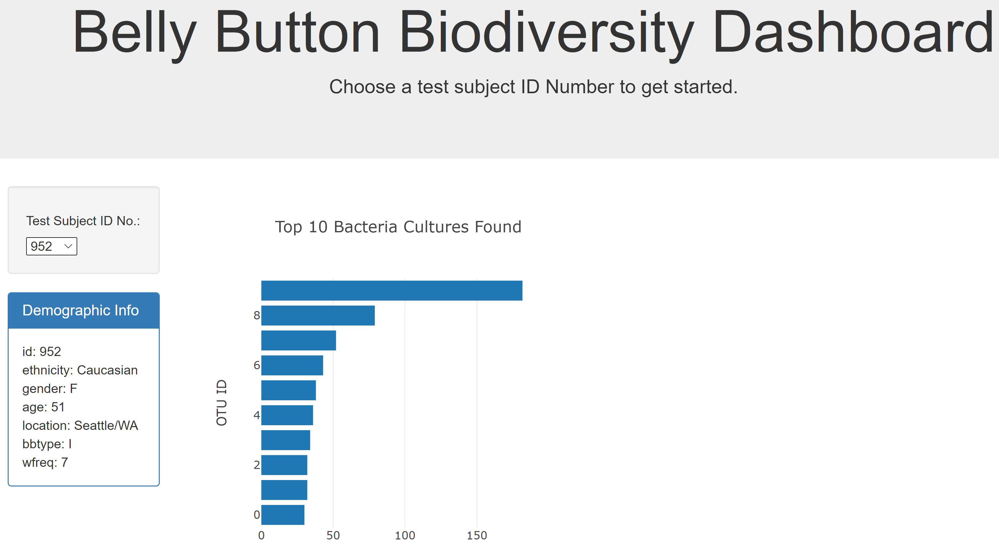

# Plotly Biodiversity Dashboard

Interactive [Plotly dashboard](https://davewamu.github.io/Plotly-Biodiversity-Dashboard/) to explore the Belly Button Biodiversity dataset, which catalogs the microbes that colonize human navels.

## Dashboard

## Steps

1. Use the D3 library to read in samples.json.
2. Create a horizontal bar chart with a dropdown menu to display the top 10 OTUs found in that individual.
   - Use sample_values as the values for the bar chart.
   - Use otu_ids as the labels for the bar chart.
   - Use otu_labels as the hovertext for the chart.
3. Create a bubble chart that displays each sample.
   - Use otu_ids for the x values.
   - Use sample_values for the y values.
   - Use sample_values for the marker size.
   - Use otu_ids for the marker colors.
   - Use otu_labels for the text values.
   - Display the sample metadata.
   - Display each key-value pair from the metadata JSON object.
   - Update all of the plots any time that a new sample is selected.
   - Deploy app to [GitHub Pages](https://davewamu.github.io/Plotly-Biodiversity-Dashboard/).

## Bacteria Cultures

## Data Source

- [Belly Button Biodiversity dataset](http://robdunnlab.com/projects/belly-button-biodiversity/)

## Authors

- **David W. Mueller**
  - [LinkedIn Profile](https://www.linkedin.com/in/davidwaltermueller/)
  - davemuelle@gmail.com

## Acknowledgments

- Michigan State University Data Analytics Bootcamp; July 6, 2021.

## References

Hulcr, J. et al. (2012) A Jungle in There: Bacteria in Belly Buttons are Highly Diverse, but Predictable. Retrieved from: <http://robdunnlab.com/projects/belly-button-biodiversity/results-and-data/>
